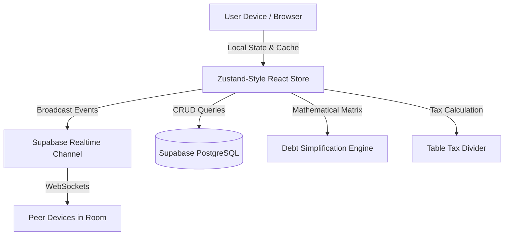

<div align="center">

# ÷ DVide

### Next-Generation Group Expense Splitting, Bill Dividing & Debt Simplification
**Crafted with iOS 27 Liquid Glass Aesthetics & Real-Time Peer Synchronization**

[](https://react.dev/)
[](https://www.typescriptlang.org/)
[](https://vitejs.dev/)
[](https://tailwindcss.com/)
[](https://supabase.com/)
[](https://web.dev/progressive-web-apps/)

</div>

---

## 🌟 Overview

**DVide** is an ultra-fluid, modern web and mobile application designed to eliminate the awkwardness and mathematical chaos of sharing expenses. Whether you're splitting a vacation cabin, dining out with friends, or managing monthly flatmate bills, DVide handles the calculations, taxes, tips, and settlement transfers effortlessly in real-time.

Built around **iOS 27 Liquid Glass design principles**, DVide combines frosted glassmorphism, dynamic spring physics, tactile haptic styling, and instant peer-to-peer WebSocket synchronization.

---

## 📸 Key Capabilities

### 1. 🧾 Table Tax & Tip Divider (Restaurant Bill Splitting)
Never struggle with restaurant math again. When everyone orders different dishes but the bill has common GST/VAT, service charges, tips, or group discounts:
- **Proportional Splitting**: Automatically taxes each diner in proportion to the value of food they consumed.
- **Equal Splitting**: Splits service charge or tip equally while keeping food items individual.
- **Live Receipt Preview**: Full transparency on how every cent or rupee is distributed before logging.

### 2. ⚡ Minimum Cash-Flow Debt Simplifier
DVide includes an optimized graph simplification engine:
- In a group of 6 people with 20 intertwined expenses, traditional tracking results in dozens of awkward cross-transfers.
- DVide computes the group's net positions and resolves all debts in the **minimum theoretical number of peer-to-peer payments**.
- Tap **"Settle Up"** for 1-tap UPI / payment links and a rewarding confetti celebration.

### 3. 👑 Room Creator & Admin Governance
- **Luminous Admin Badge**: The room creator receives a prominent `👑 Admin` badge visible to all room members.
- **Member Management**: Admins have dedicated options to remove members from the room or transfer room ownership.
- **Room Controls**: Edit room name, select currency (`₹`, `$`, `€`, `£`, `AED`), or reset the ledger.
- **Safe Deletion Disclaimer**: Permanent room deletion with a 2-step confirmation dialog with Cancel and Delete actions.
- **Role Isolation**: Guests who join via invite codes are strictly standard members and cannot claim admin privileges.

### 4. 🔄 Instant Real-Time Synchronization
- Powered by Supabase Realtime Channels.
- No need to refresh: bill updates, settlements, chat messages, and member roster changes broadcast instantaneously to all open devices across the room.
- Built-in peer state discovery guarantees guest devices sync complete expense histories the second they join.

### 5. 💬 Room Coordination & Live Receipts
- Integrated iMessage-style group chat thread within each room.
- Automatically generates receipt cards and system audit logs whenever bills are logged, edited, or settled.
- Sender crown badges identify messages originating from the Room Admin.

### 6. 📱 Apple iOS 27 Liquid Glass UI & PWA Ready
- **Fluid Floating Capsule Dock**: Smooth tab switching with glass blur navigation.
- **Installable PWA**: Works offline, caches critical assets, and includes native iOS safe-area inset handling.
- **Persona Switcher**: 1-tap "Switch to view as" developer mode to preview balances from any group member's vantage point.

---

## 🏗️ Architecture



### File Structure

```
DVide/
├── public/                     # Icons, web manifest, and PWA assets
├── src/
│   ├── components/
│   │   ├── bills/             # ExpenseCard, AddExpenseSheet, TableTaxDividerSheet
│   │   ├── chat/              # ChatThread (realtime iMessage coordination)
│   │   ├── layout/            # NavigationBar, TabBar, SettingsModal
│   │   ├── room/              # RoomMemberList, RoomSwitcherModal, InviteSheet
│   │   ├── settlement/        # SettlementMatrix (debt resolution engine)
│   │   └── ui/                # GlassCard, Badge, BottomSheet (Liquid Glass tokens)
│   ├── lib/
│   │   ├── calculations.ts    # Proportional tax, tip math & debt simplifier algorithms
│   │   ├── store.ts           # Central store, Realtime broadcast sync & Supabase bridge
│   │   └── supabase.ts        # Supabase client credentials & persistence
│   ├── types/
│   │   └── index.ts           # TypeScript interfaces (Room, Member, Expense, Chat)
│   ├── App.tsx                # Main application view container
│   ├── index.css              # iOS 27 Liquid Glass CSS tokens & animations
│   └── main.tsx               # Entrypoint & PWA registration
├── supabase/
│   └── migrations/            # Production PostgreSQL schema & RLS policies
├── package.json
└── vite.config.ts
```

---

## 🚀 Getting Started

### Prerequisites
- Node.js (v18 or higher)
- npm, pnpm, or yarn

### Installation

1. **Clone the repository:**
   ```bash
   git clone https://github.com/krisharma001/DVide.git
   cd DVide
   ```

2. **Install dependencies:**
   ```bash
   npm install
   ```

3. **Configure Environment Variables (Optional):**
   Create a `.env` file in the root directory:
   ```env
   VITE_SUPABASE_URL=https://your-project.supabase.co
   VITE_SUPABASE_ANON_KEY=your-anon-key
   ```
   > *Note: If Supabase credentials are not provided, DVide automatically operates in standalone mode using browser storage and peer broadcast!*

4. **Launch Development Server:**
   ```bash
   npm run dev
   ```
   Open [http://localhost:5173](http://localhost:5173) in your browser.

5. **Build for Production:**
   ```bash
   npm run build
   ```

---

## 🗄️ Database Setup (Supabase PostgreSQL)

If you are connecting your own Supabase instance, run the migration provided in [`supabase/migrations/20260922_init_dvide.sql`](supabase/migrations/20260922_init_dvide.sql) inside the Supabase SQL Editor.

It provisions:
- `profiles` table with avatar and display name tracking
- `rooms` table with unique 5-character invite codes and creator permissions
- `room_members` table with join timestamps
- `expenses` & `expense_splits` tables
- `settlements` & `chat_messages` tables
- Full **Row Level Security (RLS)** policies

---

## 💡 Tech Stack

| Layer | Technology |
|---|---|
| **Framework** | [React 19](https://react.dev/) |
| **Language** | [TypeScript 6](https://www.typescriptlang.org/) |
| **Styling** | [Tailwind CSS 3.4](https://tailwindcss.com/) with Custom Liquid Glass Filters |
| **Bundler** | [Vite 8](https://vitejs.dev/) |
| **Realtime & Backend** | [Supabase](https://supabase.com/) (WebSockets & PostgreSQL) |
| **Icons** | [Lucide React](https://lucide.dev/) |
| **PWA** | [vite-plugin-pwa](https://vite-pwa-org.netlify.app/) |
| **Delight** | [canvas-confetti](https://www.npmjs.com/package/canvas-confetti) |

---

## 📄 License

This project is licensed under the [MIT License](LICENSE).

---

<div align="center">
Made with 💚 by <strong>Krish Sharma</strong>
</div>
